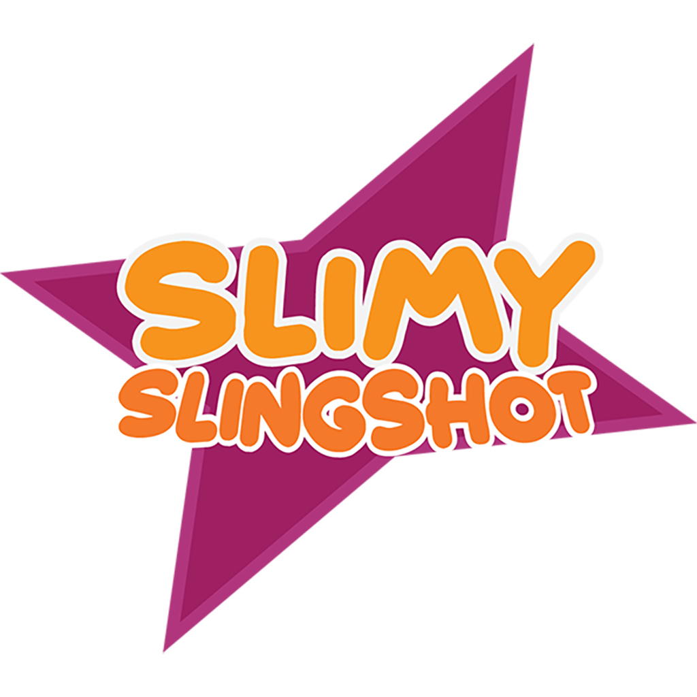

# SlimySlingshot

Slimy-Slingshot is a 2D level-based mobile game, where the player will have to learn to dominate Slimys particular way of movement. He will have to master the hability to shoot in one direction, and move towards the opposite. Our players will face difficult obstacles and enemies, and at the end of each world, they will have to fight a boss in order their adventure going.

This is a game developed by students from <a href="https://www.imagecampus.edu.ar/">Image Campus</a>

   

## Credits

- **Mercedes Albinati** - *Art* - 
Mail: mechialbinati@gmail.com
- **Jose Quintana Martín** - *Programming* - 
Mail: jquintanamartin.games@gmail.com
- **Alberto Castro** - *Programming* -  
Mail: betocastro1819@gmail.com
- **Sebastián Blejman** - *Audio* - 
Mail: sebastian@blejman.com, peaceandnoise.estudio@gmail.com
- **José Hernán Canteros** - *QA* - 
Mail: canteros.josehernan@gmail.com

This game was also possible thanks to the support of these professors:

- **Sergio Baretto**
- **Federico Barra**
- **Juan Pablo Bettini**
- **Jorge Cuéllar**
- **Fernando Puig**
- **Eugenio Taboada**

## Links

Download it from itch.io: https://stelthar.itch.io/slimy-slingshot